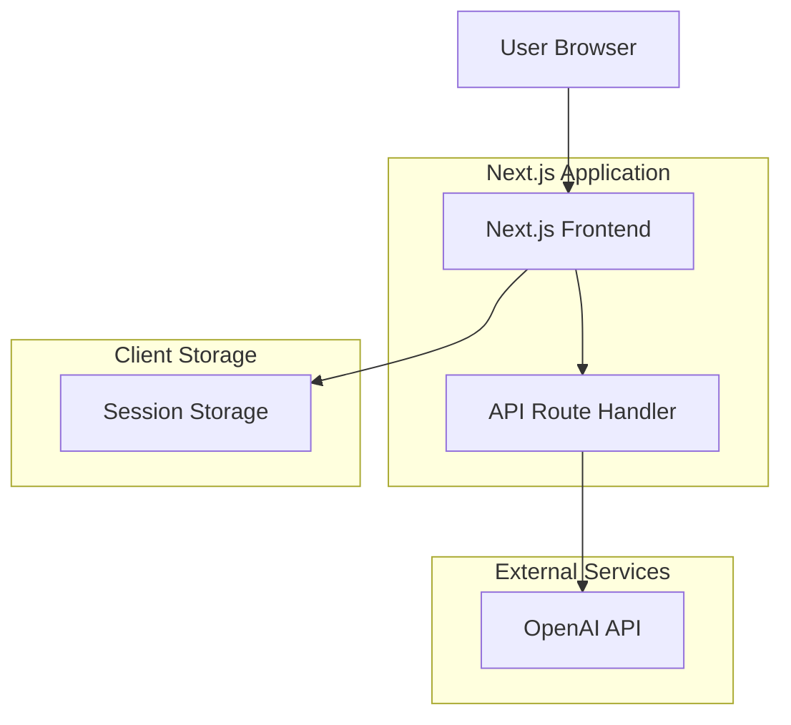
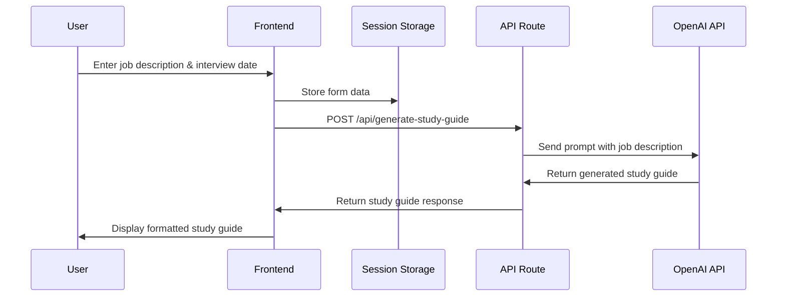

# Design Document

## Overview

The Study Guide Generator is a Next.js web application that leverages OpenAI's GPT API to create personalized technical interview preparation materials. The system follows a simple two-page flow: input collection and results display, with session-based data persistence and AI-powered content generation.

## Architecture

### Technology Stack
- **Frontend Framework**: Next.js 15.5.6 with React 19.1.0
- **Styling**: Tailwind CSS 4.0
- **Language**: TypeScript 5.x
- **AI Service**: OpenAI GPT-4.1 nano API
- **Data Persistence**: Browser sessionStorage
- **Deployment**: Vercel-ready Next.js application

### System Architecture



### Application Flow



## Components and Interfaces

### Frontend Components

#### 1. Home Page Component (`src/app/page.tsx`)
**Purpose**: Input form for collecting job description and interview date

**Key Features**:
- Form validation for required fields
- Date picker with minimum date constraint (tomorrow)
- Large textarea for job description input
- Session storage integration
- Navigation to results page

**State Management**:
```typescript
interface HomePageState {
  interviewDate: string;
  jobDescription: string;
}
```

#### 2. Results Page Component (`src/app/results/page.tsx`)
**Purpose**: Display generated study guide with loading and error states

**Key Features**:
- Session data retrieval and validation
- Loading spinner during API calls
- Error handling with retry functionality
- Formatted study guide display
- Navigation back to input form

**State Management**:
```typescript
interface ResultsPageState {
  studyGuide: string;
  loading: boolean;
  error: string;
  interviewDate: string;
}
```

### API Interface

#### Study Guide Generation Endpoint
**Route**: `POST /api/generate-study-guide`

**Request Interface**:
```typescript
interface StudyGuideRequest {
  prompt: string;
}
```

**Response Interface**:
```typescript
interface StudyGuideResponse {
  studyGuide: string;
}

interface StudyGuideErrorResponse {
  error: string;
}
```

**OpenAI Integration**:
```typescript
interface OpenAIRequest {
  model: 'gpt-4o-mini';
  messages: Array<{
    role: 'system' | 'user';
    content: string;
  }>;
  max_tokens: number;
  temperature: number;
}
```

## Data Models

### Session Data Model
```typescript
interface SessionData {
  interviewDate: string; // ISO date string (YYYY-MM-DD)
  jobDescription: string; // Raw job description text
}
```

### Study Guide Generation Model
```typescript
interface StudyGuideGeneration {
  daysUntilInterview: number;
  jobDescription: string;
  systemPrompt: string;
  userPrompt: string;
  generatedContent: string;
}
```

### API Configuration Model
```typescript
interface APIConfiguration {
  openaiApiKey: string;
  model: 'gpt-4o-mini';
  maxTokens: 2000;
  temperature: 0.7;
}
```

## Error Handling

### Client-Side Error Handling

1. **Form Validation Errors**
   - Missing interview date: Alert user to select date
   - Missing job description: Alert user to enter description
   - Invalid date (past date): Prevent selection via date picker constraints

2. **API Request Errors**
   - Network failures: Display retry option with error message
   - Server errors: Show generic error message with retry functionality
   - Timeout errors: Provide retry mechanism

3. **Session Data Errors**
   - Missing session data: Redirect to home page
   - Corrupted session data: Clear storage and redirect

### Server-Side Error Handling

1. **Request Validation**
   - Missing prompt: Return 400 Bad Request
   - Invalid request format: Return 400 Bad Request

2. **Configuration Errors**
   - Missing OpenAI API key: Return 500 Internal Server Error
   - Invalid API key: Return 500 Internal Server Error

3. **External API Errors**
   - OpenAI API failures: Log error details, return generic error message
   - Rate limiting: Return 429 Too Many Requests
   - API quota exceeded: Return 503 Service Unavailable

### Error Response Format
```typescript
interface ErrorResponse {
  error: string;
  status: number;
  timestamp?: string;
}
```

## Testing Strategy

### Unit Testing
- **API Route Testing**: Test request validation, error handling, and OpenAI integration
- **Component Testing**: Test form validation, state management, and user interactions
- **Utility Function Testing**: Test date calculations and prompt generation

### Integration Testing
- **API Integration**: Test complete flow from frontend to OpenAI API
- **Session Storage Integration**: Test data persistence across page navigation
- **Error Flow Testing**: Test error scenarios and recovery mechanisms

### End-to-End Testing
- **Complete User Journey**: Test full flow from input to study guide generation
- **Error Scenarios**: Test network failures, API errors, and recovery
- **Cross-Browser Compatibility**: Test on major browsers

### Performance Testing
- **API Response Times**: Monitor OpenAI API response times
- **Large Job Descriptions**: Test with various input sizes
- **Concurrent Users**: Test system behavior under load

## Security Considerations

### API Key Management
- Store OpenAI API key in `.env.local` file (OPENAI_API_KEY)
- Add `.env.local` to `.gitignore` to prevent key exposure
- Never expose API key in client-side code
- Use server-side API routes for external API calls

### Input Validation
- Sanitize job description input to prevent injection attacks
- Validate date inputs on both client and server side
- Implement rate limiting for API endpoints

### Data Privacy
- Use session storage (not persistent) for temporary data
- Clear session data when user navigates away
- No server-side storage of user data

## Performance Optimizations

### Frontend Optimizations
- Use Next.js built-in optimizations (code splitting, image optimization)
- Implement proper loading states to improve perceived performance
- Minimize bundle size with tree shaking

### API Optimizations
- Implement request timeout handling
- Use appropriate OpenAI model for cost/performance balance
- Consider caching for similar requests (future enhancement)

### User Experience Optimizations
- Progressive enhancement for JavaScript-disabled users
- Responsive design for mobile devices
- Accessible form controls and error messages